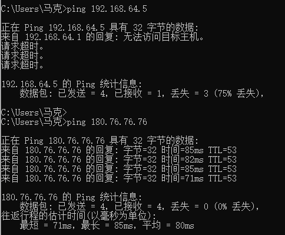
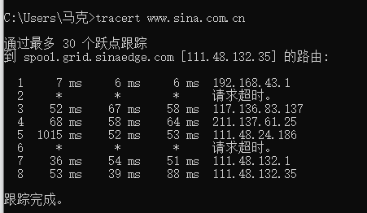

# 作业一

### ping另一台计算机

​		ping用于确定本地主机是否能与另一台主机成功交换(发送与接收)数据包，再根据返回的信息，就可以推断TCP/IP参数是否设置正确，以及运行是否正常、网络是否通畅等。

​		需要注意的是，Ping成功并不一定就代表TCP/IP配置正确，有可能还要执行大量的本地主机与远程主机的数据包交换，才能确信TCP/IP配置的正确性。如果执行ping成功而网络仍无法使用，那么问题很可能出在网络系统的软件配置方面，ping成功只保证当前主机与目的主机间存在一条连通的物理路径。

### tracert一个服务器

​		Tracert（跟踪路由）是路由跟踪实用程序，用于确定 IP 数据包访问目标所采取的路径。Tracert 命令用 IP 生存时间 (TTL) 字段和 ICMP 错误消息来确定从一个主机到网络上其他主机的路由。

​		通过向目标发送不同IP生存时间 (TTL) 值的“Internet控制消息协议 (ICMP)”回应数据包，Tracert诊断程序确定到目标所采取的路由。要求路径上的每个路由器在转发数据包之前至少将数据包上的 TTL 递减 1。数据包上的 TTL 减为 0 时，路由器应该将“ICMP 已超时”的消息发回源系统。

