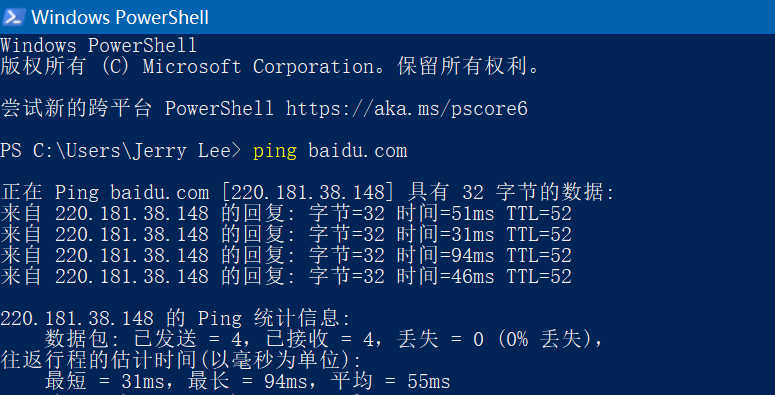
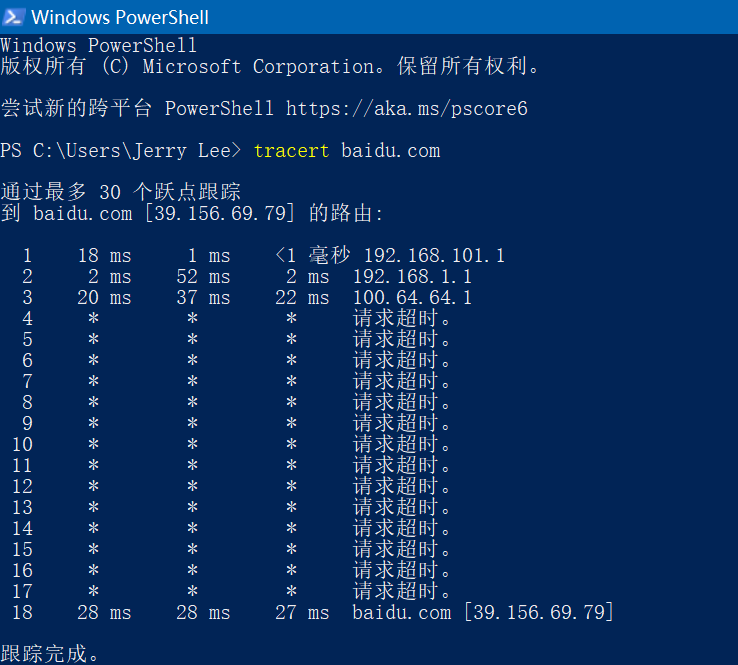

# 网络与分布式计算作业1

## ping另一台计算机

> PING（Packet Internet Groper），因特网包探索器，用于测试网络连接量的程序。Ping是工作在TCP/IP网络体系结构中应用层的一个服务命令， 主要是向特定的目的主机发送ICMP（Internet Control Message Protocol因特网报文控制协议）Echo请求报文，测试目的站是否可达及了解其有关状态。

ping百度网站的结果如下：

---

## tracert一个服务器

> Tracert（跟踪路由）是路由跟踪实用程序，用于确定IP数据包访问目标所采取的路径。Tracert命令用IP生存时间(TTL)字段和ICMP错误消息来确定从一个主机到网络上其他主机的路由.

tracert百度服务器的结果如下：

