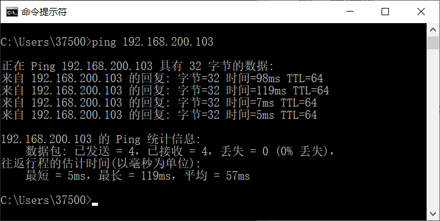
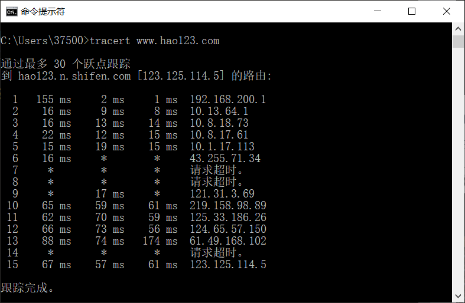

### 网络及分布式计算

#### *第一次作业*

---------------------------------------------  

#### 1. ping另外一台计算机

##### 1.1  查看另一计算机的ip

打开cmd，输入命令ipconfig

##### 1.2  本机 ping 该计算机
注意：要关闭该计算机的防火墙
  

#### 2. tracert 一个服务器

